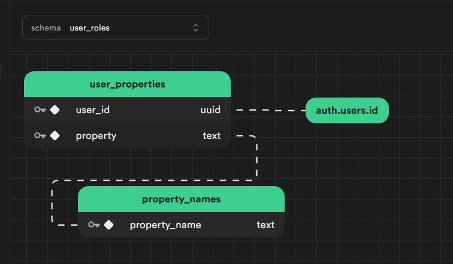
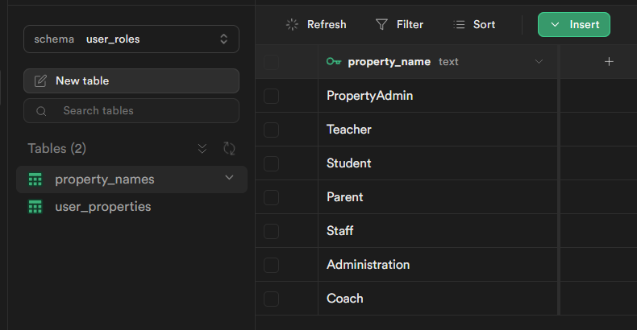
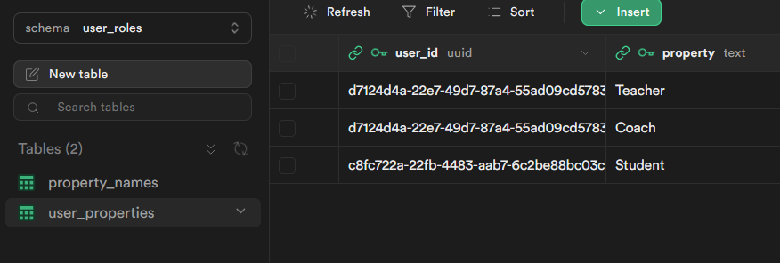
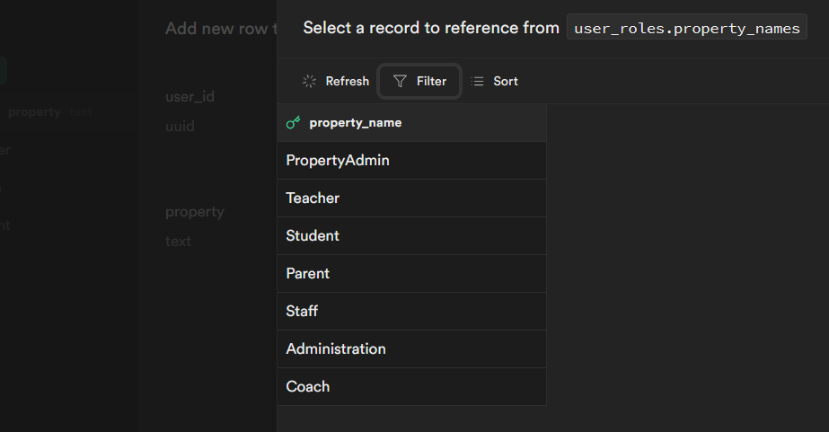
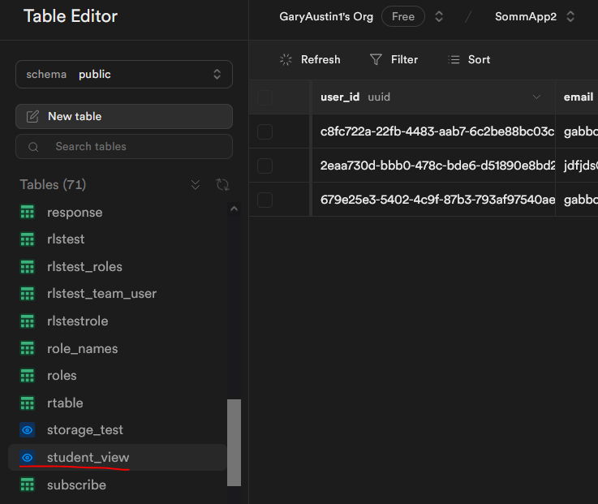

# custom-properties
Custom roles/teams/groups/claims using tables and a setof functions for RLS in Supabase environment.

THIS CODE IS STILL BEING TESTED AND DEVELOPED DO NOT USE AT THIS TIME.

Show a table based approach to roles/claims management. 
Have RLS functions use the roles/claims. 
Compare the RLS performance of using a roles table versus using a JWT custom-claims approach.  
The concept is to have a simple property name table and user properties table for each type of property desired.
All management of user properites is done thru standard table management of the user property table.
RLS by default allows postgres, service_role and an authenticated user with an admin property in the table to manage the user properties.
If the schema is added to the API schemas in the dashboard then a user can read their own properties but only the admin roles can modify.  

Many have turned to using the app_metadata column in auth.users and the user JWT for roles and claims management.
This repository https://github.com/supabase-community/supabase-custom-claims is popular for this.
This was mainly driven by the slow performance of RLS with table joins versus a function checking the JWT.
Recent testing has shown that RLS performance of generic functions and table joins can be greatly improved.
This repository also looks at that.  

A roles/claims table also has the advantage of easier admin using direct table manipulation and views.
It also allows changes in claims and roles to immediately take effect versus waiting for the JWT to refresh  

The initial approach here uses a meaningful schema name for the type of property being used.
This is in part because the goal is to make this a TLE in dbdev.
One could certainly rename the functions and tables as desired instead of using a schema name.  

If it is desired to automatically populate properties this can be done with a typical auth.users
trigger function on user creation by just inserting desired user/property pairs into the user properties table.  

The code also has an optional trigger function that will update Supabase app_metadata on any change to the user's properties in the user property table.
This json object will be named after the schema name in the current version.  

properties is the main code to set up a property in schema.  Right now this is hard coded to user_roles schema.
test.sql is sample code used to test performance of this method versus the typical custom-claims method which uses claims in the JWT as the RLS test.  

Early Performance data on 100k row table with select RLS allowed to a role run in the SQL editor as an authenticated user:

JWT custom-claims function `(select get_my_claim('role')::text) = '"Teacher"'` -  17.6msec  
custom-properties table function `(select user_roles.user_has_property('Teacher'))` 13.3msec 

Note this includes optimizations on both using guidelines for RLS on functions from : https://github.com/GaryAustin1/RLS-Performance
Without those optimizations and just calling the functions you get 208msec and 1800msec respectively.


The three RLS functions are called like:

`USING ( (select user_roles.user_has_property('Teacher') )`  
`USING ( (select user_roles.user_property_in('{"Teacher","Staff"}) )` {} is string format for array in Postgres  
`USING ( (select user_roles.user_properties_match('{"Teacher","Staff"}') )` must match all roles in array  
`USING ( (select user_roles.user_has_property('PropertyAdmin') )` default property for admin of the properties  

Example of roles:


  




Foreign key property types link enforces choices:


And the real winner with just using tables for roles, groups, etc. is being able to just user table/view operations as part of joins.
```sql
create view student_view with(security_invoker=true) as
select
  u.user_id,
  ua.email
  from user_roles.user_properties as u
  join auth.users ua on ua.id = u.user_id
  where u.property = 'Student';
```
Yields:


